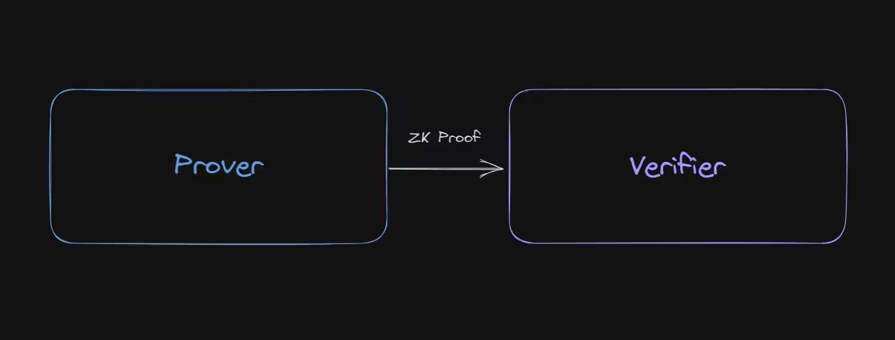
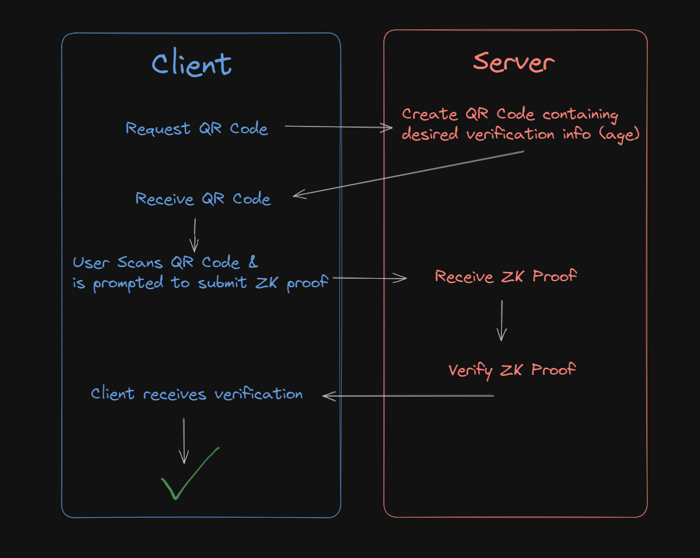

<!-- <p align="center">
  
</p> -->

<h1 align="center">
  Dononymous login with KYC credential (Lens + Polygon ID)
</h1>

We're verifying wallets with valid KYC credentials using zk proofs, thus, none/minimal profile info is being provided to us (the verifier). For more details about KYC (Lens) credential, please refer to [our KYC credential issuer](https://github.com/0xDononymous/dononymous/tree/main/app/issuer). Once the wallet is being verified, you unlock the full potential of Dononymous, enjoy!

<br/>

## Running Locally

1. Clone the repository using `git clone`.
2. Install the dependencies with `npm install`.
3. Download the Polygon ID app on [iOS](https://apps.apple.com/us/app/polygon-id/id1629870183) or [Android](https://apps.apple.com/us/app/polygon-id/id1629870183).
<!-- 4. Follow [Steph's quick setup guide](https://oceans404.notion.site/oceans404/How-to-get-a-KYCAgeCredential-Verifiable-Credential-f3d34e7c98ec4147b6b2fae79066c4f6) to get a demo VC from the [demo issuer](https://issuer-demo.polygonid.me/). -->
4. Follow [our issuer app's quick guide](https://github.com/0xDononymous/dononymous/tree/main/app/issuer) to get a verified credential.
5. Create a new file called `.env.local` in the root of the project, and copy the contents of `.env.example` into it.
6. Run `npm run dev` (if you're running from the root folder, use `npm run --prefix ./packages/verifier dev` instead.) and open [http://localhost:3000](http://localhost:3000) with your browser to start the application.
7. Install [ngrok](ngrok.com) on your machine so that you can expose your localhost API routes.
8. Using the ngrok CLI, expose your localhost API routes by running `ngrok http 3000` (for localhost:3000).
9. Update the `NEXT_PUBLIC_DEVELOPMENT_URL` in the `.env.local` file with your ngrok "Forwarding" URL.
10. Scan the QR code from the Polygon ID app to kick off the verification process.
11. (Optional): Create your own Polybase database using the schema in [PolybaseSchema.txt](./PolybaseSchema.txt) and update the `.env.local`'s `NEXT_PUBLIC_POLYBASE_NAMESPACE` value with your database namespace.

<br/>

## How It Works

Polygon ID uses a trust triangle between three parties. The **Verifier**, **Prover** (identity holder) and **Issuer**:

1. Prover: The user trying to prove they are of legal age.
2. Verifier: The website owner, trying to verify that the prover is of legal age.
3. Issuer: A source of verifiable credentials that the verifier trusts. [(Demo issuer)](https://issuer-demo.polygonid.me/)


Using ZK proofs to verify your age as a user involves a 3-step process:

### 1. Issuer provides the prover with a verifiable credential (VC)

An issuer is an entity (person, organization, or thing) that issues VCs to provers (identity holders). VCs are stored in the user's Polygon ID wallet on [iOS](https://apps.apple.com/us/app/polygon-id/id1629870183) or [Android](https://apps.apple.com/us/app/polygon-id/id1629870183). In this example, we use a [demo issuer](https://issuer-demo.polygonid.me/) that issues a VC containing their birthday.


### 2. Prover submits ZK-proof to the verifier

Now the prover (user) has a verifiable credential containing their birthday. They can now generate ZK proofs from this VC and submit them to the verifier (the website) for verification to pass some requirements (age check).

This occurs by having the user scan a QR code on the website using the Polygon ID app. The QR code contains information about what credentials the verifier wants to check about the user; such as their birthday/age.

The Polygon ID app generates a ZK proof from the VC and submits it to the verifier.



### 3. Verifier verifies the proof

The verifier trusts the issuer and can verify the proof submitted by the prover.

If the proof passes the requirements, the verifier can allow the prover to access the website.

This occurs on the server-side, by having a smart contract verify the submitted proof.


## App Architecture

Importantly, before any of this can happen, the prover must have received a verified credential from the issuer. In this demonstration, you can use the [demo issuer](https://issuer-demo.polygonid.me/) to receive a verified credential containing your birthday.

For the full-on setting up Polygon ID wallet app and claiming a VC from the demo issuer, please check out [Steph's quick setup guide](https://oceans404.notion.site/oceans404/How-to-get-a-KYCAgeCredential-Verifiable-Credential-f3d34e7c98ec4147b6b2fae79066c4f6).

The application uses both client and server to implement the trust triangle:

- The **client** acts as the prover, trying to prove their age on the website.
- The **server** acts as the verifier, verifying the proof submitted by the prover.

The flow of data is simplified in the below diagram:



Since Next.js is a server-less framework, we don't maintain state on the server; which means we need to introduce a database, to store the information of both the QR code requests and the results of the verification process.

Including the database (built on [Polybase](https://polybase.xyz/docs/get-started)), here is how the application is structured:


The above diagram shows the flow of data in the application, and the following steps:

1. The client creates a unique ID for this session.
2. When the page loads, the client requests the server to generate a QR code.
3. The QR code gets generated by the server, and:
   - The server stores the request in the database, with the unique ID of this session.
   - The server returns the QR code to the client.
4. The client displays the QR code.
5. The user scans the QR code with the Polygon ID app.
6. The Polygon ID app generates a ZK proof from the VC and submits it to the server.
7. The server verifies the proof, and:
   - The server stores the result in the database, with the unique ID.
8. The client checks every 5 seconds if a verification result is available in the database for the unique ID of this session.

<br/>

## The Code

The logic starts on the [`index.tsx`](./src/pages/index.tsx) page.

First, the client generates a unique ID for this session and asks for a QR code from the server, providing the unique ID.

```jsx
// Session ID
const sessionId = useMemo(() => uuidv4(), []);

// Generate QR code + provide session ID
const {
  data: qrCode,
  isLoading: loadingQrCode,
  isError: qrCodeError,
} = useGenerateQrCode(sessionId);
```

This is using [TanStack Query](https://tanstack.com/query/v4/docs/react/reference/useQuery) to run the code found in [`useGenerateQrCode.ts`](./src/hooks/useGenerateQrCode.ts).

This makes a fetch request to the server, which is handled by the [`/api/generate-qr-code.ts`](./src/pages/api/generate-qr-code.ts) file.

```jsx
const result = await fetch("/api/generate-qr-code", {
  method: "POST",
  headers: {
    "Content-Type": "application/json",
  },
  body: JSON.stringify({ requestId: id }),
});
```

The server creates an authorization request using the `@iden3/js-iden3-auth` library:

```jsx
// Get the session ID so we can append it to the callback URL.
const { requestId } = req.body;

const request = auth.createAuthorizationRequest(
  // Reason for the authorization request
  "Must be born before this year",

  // Polygon ID of the requester
  process.env.NEXT_PUBLIC_SENDER_DID as string,

  // Callback URL. What API Route to run to verify the proof?
  `${
    process.env.NODE_ENV === "production" // Am I in production?
      ? process.env.NEXT_PUBLIC_PRODUCTION_URL // Yes, use production URL
      : process.env.NEXT_PUBLIC_DEVELOPMENT_URL // No, use development URL
  }/api/handle-verification?requestId=${requestId}` // To verify, use the handle-verification API route
);
```

Keep in mind the callback URL here, as this is the API route that will be run when the user submits their proof from the Polygon ID app.

We then append what information we want to check about the user to the request:

```jsx
request.body.scope = [
  ...scope,
  {
    id: 1,
    circuitId: "credentialAtomicQuerySigV2",
    query: {
      allowedIssuers: ["*"],
      type: "KYCAgeCredential",
      context:
        "https://raw.githubusercontent.com/iden3/claim-schema-vocab/main/schemas/json-ld/kyc-v3.json-ld",
      credentialSubject: {
        birthday: {
          $lt: 20230101,
        },
      },
    },
  },
];
```

Next, store this in the database so that our callback function can read the original request:

```jsx
const db = new Polybase({
  defaultNamespace: process.env.NEXT_PUBLIC_POLYBASE_NAMESPACE,
});

await db.collection("Requests").create([requestId, JSON.stringify(request)]);
```

Finally, return the QR code to the client so the user can scan it:

```jsx
res.status(200).json({ request });
```

Now we're back at the client. Let's display the QR code:

```jsx
{
  qrCodeError && (
    <p className="text-center">Something went wrong generating the QR code.</p>
  );
}

{
  !qrCodeError && loadingQrCode ? (
    <p className="text-center">Loading...</p>
  ) : (
    <div className="flex justify-center">
      <Canvas
        text={JSON.stringify(qrCode)}
        options={{
          width: 384,
        }}
      />
    </div>
  );
}
```

At this point, the client is waiting for the user to scan the QR code with the Polygon ID app. In the meantime, we start asking the database "hey, have you gotten a verification result for this session ID yet?".

```jsx
const { data: verificationResponse } = useCheckForResponse(sessionId, !!qrCode);
```

This again uses TanStack Query to call the logic found in the [`useVerificationResponse.ts`](./src/hooks/useVerificationResponse.ts) file.

```jsx
const checkForResponse = async (id: string) => {
  const db = new Polybase({
    defaultNamespace: process.env.NEXT_PUBLIC_POLYBASE_NAMESPACE,
  });

  const record = await db
    .collection("Responses")
    .record(id as string)
    .get();

  if (record.exists()) {
    const { data } = record;
    return data;
  }

  throw new Error("No response found yet. React Query will try again");
};
```

The hook re-runs this every 5 seconds until it gets a response.

```jsx
export default function useCheckForResponse(
  id: string,
  enabled: boolean = true
) {
  return useQuery({
    queryKey: ["checkForResponse", id],
    queryFn: () => checkForResponse(id),
    retry: true,
    retryDelay: 5000, // Retry every 5 seconds
    retryOnMount: true,
    enabled, // Don't run unless we have a QR code
  });
}
```

In the meantime, the user is hopefully scanning the QR code and generating a ZK proof to submit.

Once the user submits their ZK proof from the Polygon ID app, the callback function we defined is run. The callback function is stored in the [`/api/handle-verification.ts`](./src/pages/api/handle-verification.ts) file.

First, this function reads the original request from the database.

```jsx
// Get the session ID to find the original request
const { requestId } = req.query;

// Initialize DB
const db = new Polybase({
  defaultNamespace: process.env.NEXT_PUBLIC_POLYBASE_NAMESPACE,
});

// Read the original request from the database using the session ID as the key
const record = await db
  .collection("Requests")
  .record(requestId as string)
  .get();
const { data } = record;
const authRequest = JSON.parse(JSON.stringify(data));
```

Now we have the original request, we know what the user was trying to prove. But we need to verify it.

To do that, we submit it to a smart contract to verify.

```jsx
const raw = await getRawBody(req);
const tokenStr = raw.toString().trim();

// The CredentialAtomicQuerySigValidator contract is used to verify any credential-related zk proof
// generated by the user using the credentialAtomicQuerySigV2OnChain circuit.
// https://0xpolygonid.github.io/tutorials/contracts/overview/#blockchain-addresses
const mumbaiContractAddress = "0x134B1BE34911E39A8397ec6289782989729807a4";
const ethStateResolver = new resolver.EthStateResolver(
  "https://mumbai.rpc.thirdweb.com",
  mumbaiContractAddress
);

const resolvers = {
  ["polygon:mumbai"]: ethStateResolver,
};

// Locate the directory that contains circuit's verification keys
const verificationKeyloader = new loaders.FSKeyLoader(
  path.join(process.cwd(), "keys")
);

const sLoader = new loaders.UniversalSchemaLoader("ipfs.io");
const verifier = new auth.Verifier(verificationKeyloader, sLoader, resolvers);

const authResponse = await verifier.fullVerify(
  tokenStr,
  JSON.parse(authRequest.request),
  {
    acceptedStateTransitionDelay: 5 * 60 * 1000, // up to a 5 minute delay accepted by the Verifier
  }
);
```

Once it's verified, we store the response in the database.

```jsx
await db
  .collection("Responses")
  .create([requestId as string, JSON.stringify(authResponse)]);
```

Once it's in the database, our hook picks up the response on the client, since its been polling the database for a response.

Finally, we show this information on the UI:

```jsx
<p className="text-center max-w-2xl mb-4 text-2xl">
  Your current status:{" "}
  {!!verificationResponse ? (
    <span className="text-green-400">Verified</span>
  ) : (
    <span className="text-red-400">Not verified</span>
  )}
</p>
```

## Reach Out

Enjoy this repo? Consider starring the repo on [GitHub](https://github.com/jarrodwatts/polygon-id) & follow me on [Twitter](https://twitter.com/jarrodwattsdev)!

Got questions? Send me a message in the [Discord](https://discord.com/invite/4eQBm7DDNS)!
